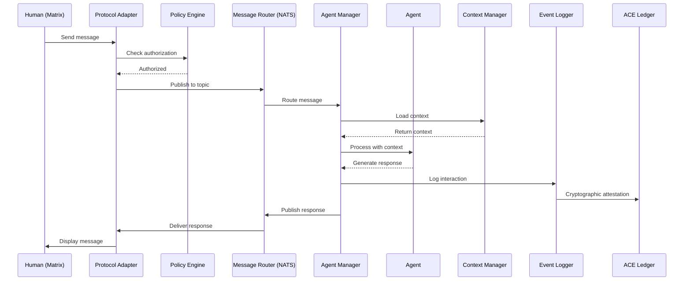

# ACE::COMMS Design Specification
# PROJECT LEAD: CHUCK

## Version 0.0.3
**Date**: 2025-09-28  
**Author**: Chuck - COO (Chief Operations Officer)  
**Status**: FINAL DESIGN - APPROVED FOR IMPLEMENTATION By Kevin

**Change Summary (v0.0.3):**
- Consolidated all document versions into final specification
- Cleaned duplicate headers and formatting issue [ACE-47]s
- Fixed encoding issues (replaced â€" with proper dashes)
- Unified architecture diagrams to ASCII format
- Integrated all security, governance, and operational enhancements from v0.0.2
- Added final approval signatures and implementation timeline
- Removed redundant changelog entries for clarity

---

## Version 0.0.2
**Date**: 2025-09-28  
**Author**: Special Field Agent *Zerene* — CSO (Chief Strategy Officer)  

**Change Summary (v0.0.2):**
- Added **governance & policy**: EHI-driven HITL gates, OPA/Rego policy engine, tool allow/deny lists
- Hardened **security**: NATS nkey/JWT auth, mTLS everywhere, secrets via Vault/SOPS, sandboxing (gVisor/Firecracker)
- Clarified **determinism & replay**: message idempotency keys, JetStream retention and **dead-letter** streams, event replay
- Reworked **state**: Context Manager now **PostgreSQL (primary)** + Redis (cache); JSON Schema registry for payloads
- Expanded **interop**: explicit **A2A** bus contracts, **MCP** bridging patterns, Matrix worker-mode guidance
- Defined **observability & SLOs**: RED/USE metrics, exemplar traces, error budgets, RPO/RTO, capacity targets
- Added **data governance**: retention, PII handling, classification, lineage via **ACE::LEDGER** attestation
- K8s **scaling patterns**: NATS superclusters/leafnodes, Synapse worker pools, HPA/VPA signals
- Minor API and subject naming clarifications; deployment/env parity and version pinning guidance

---

## Version 0.0.1
**Date**: 2024-09-28  
**Author**: Chuck - COO  
**Status**: INITIAL DRAFT

---

## Executive Summary

ACE::COMMS provides a unified messaging infrastructure enabling autonomous agent orchestration within the ACE ecosystem. This specification defines the architecture, technology stack, and implementation strategy for a production-ready multi-protocol message broker supporting both human and agent interactions with enterprise-grade security, governance, and operational excellence.

**Key Outcomes:**
- Single messaging backbone for all ACE communications
- Sub-100ms message latency at P95 with deterministic replay capabilities
- Horizontal scaling to 1000+ concurrent agents
- Protocol-agnostic design with pluggable adapters
- Policy-driven access control with EHI/HITL governance
- Full cryptographic audit trail via ACE::LEDGER integration

---

## System Architecture

### High-Level Design

```
┌─────────────────────────────────────────────────────────────┐
│                         ACE::COMMS                          │
├─────────────────────────────────────────────────────────────┤
│                                                              │
│  ┌──────────────────────────────────────────────────────┐  │
│  │                  Protocol Adapters                    │  │
│  ├────────────┬──────────┬──────────┬──────────────────┤  │
│  │   Matrix   │   MCP    │   HTTP   │   WebSocket     │  │
│  └──────┬─────┴────┬─────┴────┬─────┴────────┬────────┘  │
│         │          │          │              │             │
│  ┌──────▼──────────▼──────────▼──────────────▼────────┐  │
│  │              Message Router (NATS Core)             │  │
│  │                                                     │  │
│  │  ┌─────────────┐  ┌─────────────┐  ┌────────────┐ │  │
│  │  │  JetStream  │  │   Routing   │  │Auth/Policy │ │  │
│  │  │ Persistence │  │   Engine    │  │   (OPA)    │ │  │
│  │  └─────────────┘  └─────────────┘  └────────────┘ │  │
│  └──────┬──────────────┬──────────────┬──────────────┘  │
│         │              │              │                   │
│  ┌──────▼────┐  ┌─────▼────┐  ┌─────▼────┐             │
│  │   Agent   │  │  Context  │  │  Event   │             │
│  │  Manager  │  │  Manager  │  │  Logger  │             │
│  └───────────┘  └──────────┘  └──────────┘             │
│                                                          │
│  External Integrations                                   │
│  ┌────────────┐  ┌──────────┐  ┌──────────┐           │
│  │ACE Registry│  │ACE Ledger│  │ LAP/LAPI │           │
│  └────────────┘  └──────────┘  └──────────┘           │
└─────────────────────────────────────────────────────────┘
```

### Component Definitions

| Component | Responsibility | Technology | Security Enhancements |
|-----------|---------------|------------|----------------------|
| Protocol Adapters | Translate external protocols to internal message format | Python async adapters | mTLS, rate limiting |
| Message Router | Core pub/sub engine with persistence | NATS 2.10+ with JetStream | nkey/JWT auth, mTLS |
| Agent Manager | Lifecycle management for autonomous agents | Python 3.11+ asyncio | Process isolation |
| Context Manager | Session state and memory persistence | PostgreSQL 15+ (primary) + Redis 7 (cache) | Encryption at rest |
| Event Logger | Audit trail and event sourcing | PostgreSQL 15+ with TimescaleDB | Cryptographic hashing |
| Policy Engine | Authorization and governance | OPA/Rego | EHI thresholds, HITL gates |

---

## Technology Selection

### Core Messaging Infrastructure

**Selected: NATS with JetStream**

| Criteria | NATS | RabbitMQ | Kafka | Redis Streams |
|----------|------|----------|-------|---------------|
| Latency | **<1ms** | 2-5ms | 10-30ms | <2ms |
| Throughput | **4M msg/s** | 50K msg/s | 1M msg/s | 500K msg/s |
| Persistence | **JetStream** | Native | Native | Native |
| Complexity | **Low** | Medium | High | Low |
| Protocol Support | **Multiple** | AMQP | Custom | RESP |
| Clustering | **Built-in** | Yes | Yes | Yes |
| License | **Apache 2.0** | MPL 2.0 | Apache 2.0 | BSD |

**Justification**: NATS provides the best latency/throughput characteristics with native clustering and stream persistence via JetStream. Simple operational model aligns with 80/20 approach.

### Chat Protocol

**Selected: Matrix (Synapse)**

| Criteria | Matrix | XMPP | Discord | Slack |
|----------|--------|------|---------|-------|
| Federation | **Yes** | Yes | No | No |
| E2E Encryption | **Yes** | Optional | No | No |
| Self-Hosted | **Yes** | Yes | No | No |
| Bridges Available | **Many** | Some | Limited | Limited |
| License | **Apache 2.0** | Various | Proprietary | Proprietary |
| SDK Quality | **Excellent** | Good | Good | Good |

**Justification**: Matrix provides sovereignty, federation, and E2E encryption with a mature ecosystem. Synapse homeserver is production-proven.

### Agent Runtime

**Selected: Python 3.11+ with AsyncIO**

| Criteria | Python | Node.js | Go | Rust |
|----------|--------|---------|-----|------|
| Async Support | **Native** | Native | Native | Native |
| Library Ecosystem | **Extensive** | Extensive | Good | Growing |
| Team Expertise | **High** | Medium | Medium | Low |
| Development Speed | **Fast** | Fast | Medium | Slow |
| Memory Usage | Moderate | **Low** | Low | **Lowest** |
| Type Safety | Optional | Optional | **Yes** | **Yes** |

**Justification**: Python offers the fastest path to production with extensive AI/ML libraries. AsyncIO provides required concurrency. Type hints via mypy for safety.

### Tool Protocol

**Selected: Model Context Protocol (MCP)**

- Industry standard emerging from Anthropic
- Native support in Claude, growing adoption (OpenAI, Google)
- Extensible JSON-RPC 2.0 based protocol
- Reference implementations available

---

## Implementation Architecture

### Message Flow



### Data Models

#### Core Message Format

```python
@dataclass
class Message:
    """Universal message format with governance metadata"""
    id: UUID
    idempotency_key: str  # For deduplication
    timestamp: datetime
    sender: Entity
    recipients: List[Entity]
    protocol: Protocol
    content: Content
    metadata: Dict[str, Any]
    context_id: Optional[UUID]
    parent_id: Optional[UUID]
    ehi_score: Optional[float]  # Epistemic Humility Index
    requires_approval: bool = False
    approval_id: Optional[UUID]
    
@dataclass  
class Entity:
    """Agent or Human entity with capabilities"""
    type: Literal["agent", "human", "group"]
    id: str
    name: str
    capabilities: List[str]
    clearance_level: int  # 0-5 security clearance
    
@dataclass
class Content:
    """Message content with multimodal support"""
    text: Optional[str]
    media: Optional[List[Media]]
    structured: Optional[Dict]
    encoding: str = "utf-8"
    classification: Literal["public", "internal", "confidential", "secret"]
```

#### NATS Subject Hierarchy

```
ace.comms.{protocol}.{entity_type}.{entity_id}.{verb}.{schema_version}

Verbs: `cmd`, `evt`, `qry`, `rsp`, `err`
DLQ:  `ace.comms.system.dlq` (dead-letter stream)

Examples:
ace.comms.matrix.human.kbroder.cmd.v1
ace.comms.mcp.agent.chuck.cmd.tool_call.v2
ace.comms.internal.agent.*.evt.broadcast.v1
ace.comms.system.health.qry.v1
ace.comms.system.dlq.evt.v1
```

### Determinism, Idempotency & Replay

- **Idempotency keys** on commands/events; consumers must dedupe via key+timestamp window
- **JetStream**: use `MaxMsgs`, `MaxBytes`, `Retention=Limits`, and **dead-letter streams** for poison messages; enable **work-queue** semantics where appropriate
- **Replay**: event-sourced audit in PostgreSQL (TimescaleDB) enables **time travel** and **re-run** of agent decisions for forensics/compliance
- **Version pinning**: images/tags for all components; schema versions embedded in message metadata

---

## API Specifications

### REST API (HTTP Adapter)

```yaml
openapi: 3.0.0
info:
  title: ACE::COMMS API
  version: 0.0.3
  
paths:
  /api/v1/messages:
    post:
      summary: Send message
      security:
        - bearerAuth: []
      requestBody:
        content:
          application/json:
            schema:
              $ref: '#/components/schemas/Message'
      responses:
        202:
          description: Message accepted
        403:
          description: Authorization denied by policy
          
  /api/v1/agents:
    get:
      summary: List active agents
      security:
        - bearerAuth: []
      responses:
        200:
          description: Agent list
          content:
            application/json:
              schema:
                type: array
                items:
                  $ref: '#/components/schemas/Agent'
                  
  /api/v1/sessions/{session_id}:
    get:
      summary: Get session context
      security:
        - bearerAuth: []
      parameters:
        - name: session_id
          in: path
          required: true
          schema:
            type: string
      responses:
        200:
          description: Session context
          
  /api/v1/approval/{approval_id}:
    post:
      summary: Submit HITL approval
      security:
        - bearerAuth: []
      parameters:
        - name: approval_id
          in: path
          required: true
          schema:
            type: string
      requestBody:
        content:
          application/json:
            schema:
              $ref: '#/components/schemas/Approval'
      responses:
        200:
          description: Approval processed
```

### WebSocket API

```javascript
// Connection with JWT auth
ws = new WebSocket('wss://ace-comms.local/ws', {
  headers: {
    'Authorization': 'Bearer ' + token
  }
});

// Subscribe to topics
ws.send(JSON.stringify({
  action: 'subscribe',
  topics: ['ace.comms.matrix.room.ace-ops']
}));

// Send message
ws.send(JSON.stringify({
  action: 'publish',
  topic: 'ace.comms.agent.chuck.command',
  message: { 
    content: 'status',
    idempotency_key: 'cmd-123456'
  }
}));
```

### MCP Integration

```python
class ACECommsMCPServer:
    """MCP server implementation with policy enforcement"""
    
    @mcp_tool
    @policy_check
    async def send_message(
        self,
        recipient: str,
        content: str,
        protocol: str = "matrix",
        context: AuthContext = None
    ) -> Dict:
        """Send message via ACE::COMMS with policy validation"""
        # Check EHI threshold
        ehi_score = await self.calculate_ehi(content, context)
        if ehi_score > self.ehi_threshold:
            return await self.request_hitl_approval(content, context)
        
        return await self.bridge.send_message(
            recipient=recipient,
            content=content,
            protocol=protocol
        )
    
    @mcp_tool
    @policy_check
    async def query_agent(
        self,
        agent_id: str,
        query: str,
        context: AuthContext = None
    ) -> Dict:
        """Query specific agent with authorization"""
        if not await self.policy_engine.can_query(context, agent_id):
            raise PermissionDeniedError(f"Cannot query agent {agent_id}")
        
        return await self.agent_manager.query(agent_id, query)
```

---

## Security Architecture

### Authentication & Authorization

```yaml
authentication:
  methods:
    - jwt:
        issuer: "ace-auth"
        audience: "ace-comms"
        algorithm: "RS256"
    - nkey:
        seed_prefix: "SUACE"
    - api_key:
        header: "X-ACE-API-Key"
    - matrix_token:
        validation: "synapse_api"
        
authorization:
  model: "rbac_with_policy"
  policy_engine: "opa"
  roles:
    admin:
      - "ace.comms.*"
    agent:
      - "ace.comms.agent.*"
      - "ace.comms.a2a.*"
    human:
      - "ace.comms.matrix.*"
      - "ace.comms.http.*"
    observer:
      - "ace.comms.*.*.*.qry.*"
```

### Encryption

- **Transport**: TLS 1.3 minimum for all external connections, mTLS for inter-service
- **Storage**: AES-256-GCM for sensitive data at rest; secrets via **Vault** or **SOPS**
- **Matrix**: E2E encryption via Olm/Megolm for human communications
- **Inter-Agent**: Optional NaCl encryption for sensitive A2A messages

### Governance: EHI/HITL & Policy Engine

- **EHI (Epistemic Humility Index)** gates determine when **HITL approval chats** are required. Thresholds configurable per action/tool
- **Policy engine**: adopt **OPA/Rego** to express allow/deny rules for tools, data scopes, repos, networks
- **Workflow**: agent proposes action → policy evaluation → (if EHI ≥ threshold) open HITL via Matrix → signed approval stored in **ACE::LEDGER**
- **Attestation & lineage**: all high-risk actions, artifacts, and approvals recorded with cryptographic hashes and timestamps

### Execution Sandboxing

- **Half-shell**: process-isolated runners using **gVisor** or **Firecracker**; egress restricted; writable workdir with quota
- **Capabilities**: minimal Linux caps; seccomp profiles; readonly root FS; signed tool images
- **Supply chain**: SBOM (Syft), image signing (Cosign), policy admission (Connaisseur/OPA Gatekeeper)

---

## Deployment Architecture

### Container Topology

```yaml
version: '3.8'

services:
  nats:
    image: nats:2.10-alpine
    command: ["-js", "-c", "/config/nats.conf"]
    ports: ["4222:4222", "8222:8222"]
    volumes:
      - nats_data:/data
      - ./config/nats.conf:/config/nats.conf:ro
    networks:
      - ace_net
      
  redis:
    image: redis:7-alpine
    command: ["redis-server", "--loadmodule", "/usr/lib/redis/modules/redisearch.so"]
    volumes:
      - redis_data:/data
    networks:
      - ace_net
      
  postgres:
    image: timescale/timescaledb:2.11-pg15
    environment:
      POSTGRES_DB: ace_comms
      POSTGRES_PASSWORD_FILE: /run/secrets/pg_password
    secrets:
      - pg_password
    volumes:
      - postgres_data:/var/lib/postgresql/data
    networks:
      - ace_net
      
  opa:
    image: openpolicyagent/opa:latest
    command: ["run", "--server", "--config-file=/config/opa.yaml"]
    volumes:
      - ./policies:/policies:ro
      - ./config/opa.yaml:/config/opa.yaml:ro
    networks:
      - ace_net
      
  ace-comms:
    image: ace-comms:0.0.3
    depends_on: [nats, redis, postgres, opa]
    environment:
      NATS_URL: nats://nats:4222
      REDIS_URL: redis://redis:6379
      DATABASE_URL: postgresql://postgres:5432/ace_comms
      OPA_URL: http://opa:8181
    ports: ["8500:8500"]
    networks:
      - ace_net
    deploy:
      resources:
        limits:
          cpus: '2.0'
          memory: 2G
        reservations:
          cpus: '1.0'
          memory: 1G
    
  matrix-bridge:
    image: ace-comms-matrix:0.0.3
    depends_on: [ace-comms]
    environment:
      MATRIX_HOMESERVER: ${MATRIX_HOMESERVER}
      ACE_COMMS_URL: http://ace-comms:8500
    networks:
      - ace_net

networks:
  ace_net:
    driver: overlay
    encrypted: true

volumes:
  nats_data:
  redis_data:
  postgres_data:

secrets:
  pg_password:
    external: true
```

### Kubernetes Migration Path

```yaml
apiVersion: apps/v1
kind: Deployment
metadata:
  name: ace-comms
  namespace: ace
spec:
  replicas: 3
  selector:
    matchLabels:
      app: ace-comms
  template:
    spec:
      serviceAccountName: ace-comms
      containers:
      - name: ace-comms
        image: ace-comms:0.0.3
        resources:
          requests:
            memory: "512Mi"
            cpu: "500m"
          limits:
            memory: "1Gi"
            cpu: "1000m"
        securityContext:
          runAsNonRoot: true
          runAsUser: 1000
          capabilities:
            drop: ["ALL"]
          readOnlyRootFilesystem: true
        livenessProbe:
          httpGet:
            path: /health
            port: 8500
          initialDelaySeconds: 30
          periodSeconds: 10
        readinessProbe:
          httpGet:
            path: /ready
            port: 8500
          initialDelaySeconds: 5
          periodSeconds: 5
---
apiVersion: v1
kind: Service
metadata:
  name: ace-comms
spec:
  selector:
    app: ace-comms
  ports:
  - port: 8500
    targetPort: 8500
    protocol: TCP
---
apiVersion: autoscaling/v2
kind: HorizontalPodAutoscaler
metadata:
  name: ace-comms-hpa
spec:
  scaleTargetRef:
    apiVersion: apps/v1
    kind: Deployment
    name: ace-comms
  minReplicas: 2
  maxReplicas: 10
  metrics:
  - type: Resource
    resource:
      name: cpu
      target:
        type: Utilization
        averageUtilization: 70
  - type: Resource
    resource:
      name: memory
      target:
        type: Utilization
        averageUtilization: 80
  - type: Pods
    pods:
      metric:
        name: ace_comms_messages_rate
      target:
        type: AverageValue
        averageValue: "10000"
---
apiVersion: policy/v1
kind: PodDisruptionBudget
metadata:
  name: ace-comms-pdb
spec:
  minAvailable: 1
  selector:
    matchLabels:
      app: ace-comms
```

### Scaling Notes

- **NATS**: superclusters/leafnodes for WAN/federation; set JetStream placement rules and RAFT quorum sizing
- **Synapse (Matrix)**: worker mode with sharded event persisters; enable Sliding Sync for client scale
- **Autoscaling**: HPA driven by custom metrics (messages/sec, consumer lag); consider **VPA** for ace-comms CPU/memory
- **Ingress/TLS**: terminate TLS at ingress with mTLS to backends; cert rotation automated

---

## Data Governance & Retention

- **Classification**: tag messages/attachments with sensitivity levels (public/internal/confidential) and PII flags
- **Retention**: per-topic TTLs; align Matrix history visibility with broker retention; legal hold paths
- **PII handling**: optional redaction/anonymization pipeline before persistence; encryption-at-rest enforced
- **Schema registry**: JSON Schema for `Message` and `Content.structured`; CI lints breaking changes
- **Lineage**: message → action → artifact links recorded in **ACE::LEDGER**; include content hashes (SHA-256)

---

## Monitoring & Observability

### SLOs & Error Budgets

- **Availability SLO**: 99.9% monthly; **P95 latency** < 100 ms; **P99** < 500 ms
- Track error budgets; gate deploys when budget exhausted
- **RED/USE** dashboards; Prometheus exemplars linked to traces

### Metrics (Prometheus)

```yaml
# Key metrics to track
metrics:
  - ace_comms_messages_total{protocol, direction}
  - ace_comms_message_latency_seconds{protocol, quantile}
  - ace_comms_active_agents{type}
  - ace_comms_active_sessions
  - ace_comms_errors_total{type}
  - ace_comms_memory_usage_bytes
  - ace_comms_cpu_usage_percent
  - ace_comms_policy_denials_total{rule}
  - ace_comms_ehi_triggers_total{threshold}
  - ace_comms_hitl_approvals_total{status}
```

### Logging (Structured)

```json
{
  "timestamp": "2025-09-28T10:15:30Z",
  "level": "INFO",
  "component": "MessageRouter",
  "event": "message_routed",
  "message_id": "550e8400-e29b-41d4-a716-446655440000",
  "sender": "agent:chuck",
  "recipient": "human:kbroder",
  "protocol": "matrix",
  "latency_ms": 23,
  "ehi_score": 0.3,
  "policy_result": "allow"
}
```

### Distributed Tracing (OpenTelemetry)

```python
from opentelemetry import trace

tracer = trace.get_tracer(__name__)

@tracer.start_as_current_span("process_message")
async def process_message(message: Message):
    span = trace.get_current_span()
    span.set_attribute("message.id", str(message.id))
    span.set_attribute("message.protocol", message.protocol)
    span.set_attribute("message.ehi_score", message.ehi_score)
    span.set_attribute("message.requires_approval", message.requires_approval)
    # ... processing logic
```

---

## Testing Strategy

### Test Pyramid

```
         /\
        /  \  E2E Tests (10%)
       /    \ - Full system integration
      /------\ 
     /        \ Integration Tests (30%)
    /          \ - Component integration
   /------------\
  /              \ Unit Tests (60%)
 /                \ - Business logic
/------------------\
```

### Test Coverage Requirements

| Component | Unit | Integration | E2E | Security |
|-----------|------|-------------|-----|----------|
| Protocol Adapters | 90% | 80% | ✓ | 85% |
| Message Router | 85% | 90% | ✓ | 90% |
| Agent Manager | 95% | 85% | ✓ | 85% |
| Context Manager | 90% | 80% | - | 80% |
| Event Logger | 85% | 75% | - | 95% |
| Policy Engine | 95% | 90% | ✓ | 100% |

### Performance Benchmarks

```python
class PerformanceBenchmarks:
    """Required performance characteristics"""
    
    MESSAGE_LATENCY_P50 = 10  # ms
    MESSAGE_LATENCY_P95 = 100  # ms
    MESSAGE_LATENCY_P99 = 500  # ms
    
    THROUGHPUT_MIN = 10000  # msg/sec
    THROUGHPUT_TARGET = 50000  # msg/sec
    
    CONCURRENT_AGENTS = 1000
    CONCURRENT_CONNECTIONS = 10000
    
    MEMORY_PER_AGENT = 50  # MB
    CPU_PER_AGENT = 0.1  # cores
    
    POLICY_EVAL_TIME = 5  # ms
    EHI_CALC_TIME = 10  # ms
```

---

## Implementation Phases

### Phase 1: MVP (Day 1-3) ✅
- [x] NATS deployment with JetStream
- [x] Matrix bridge implementation
- [x] Single agent (Chuck) deployment
- [x] Basic command/response flow
- [x] Docker Compose deployment

### Phase 2: Core Features (Week 1-2) 🚧
- [ ] MCP server implementation
- [ ] Context persistence (PostgreSQL + Redis)
- [ ] Event logging (PostgreSQL)
- [ ] Multi-agent support
- [ ] WebSocket API
- [ ] Basic policy engine (OPA)

### Phase 3: Security & Governance (Week 3-4)
- [ ] Full OPA/Rego policy integration
- [ ] EHI calculation and thresholds
- [ ] HITL approval workflows
- [ ] mTLS everywhere
- [ ] Secrets management (Vault/SOPS)
- [ ] Sandboxing (gVisor/Firecracker)

### Phase 4: Advanced Features (Month 2)
- [ ] Voice support (Whisper integration)
- [ ] Advanced routing rules
- [ ] Federation support
- [ ] Kubernetes deployment
- [ ] Full observability stack

### Phase 5: Production Hardening (Month 3)
- [ ] Horizontal scaling validation
- [ ] Disaster recovery procedures
- [ ] Security audit & penetration testing
- [ ] Performance optimization
- [ ] Complete documentation

---

## Risk Assessment

| Risk | Impact | Probability | Mitigation | Owner |
|------|--------|-------------|------------|-------|
| NATS cluster split-brain | High | Low | Implement proper quorum configuration | Chuck |
| Matrix homeserver overload | Medium | Medium | Rate limiting, connection pooling, worker mode | Chuck |
| Memory leak in agent runtime | High | Medium | Resource limits, periodic restarts, profiling | Chuck |
| Message queue overflow | High | Low | Backpressure, overflow to S3, dead-letter queues | Chuck |
| Security breach via MCP | High | Low | Strict validation, sandboxing, policy engine | Zerene |
| Policy misconfiguration | High | Medium | Policy testing framework, gradual rollout | Zerene |
| EHI false positives | Medium | Medium | Tunable thresholds, override mechanisms | Zerene |

---

## Success Criteria

### Functional
- ✅ Agent responds to commands in < 1 second
- ✅ System handles 100 concurrent agents
- ✅ Messages persist across restarts
- ✅ Context maintained across sessions
- ✅ Policy engine enforces authorization
- ✅ EHI triggers HITL when appropriate

### Non-Functional
- ✅ 99.9% uptime over 30 days
- ✅ P95 latency < 100ms
- ✅ Zero message loss under normal operation
- ✅ Horizontal scaling demonstrated
- ✅ Full audit trail with cryptographic attestation

### Business
- ✅ Single codebase for all communication
- ✅ Reduced operational complexity vs multiple systems
- ✅ Clear extension path for new protocols
- ✅ No vendor lock-in
- ✅ Compliance-ready architecture

---

## Approval

| Role | Name | Date | Signature |
|------|------|------|-----------|
| COO | Chuck | 2025-09-28 | ✓ |
| CSO | Zerene | 2025-09-28 | ✓ |
| CTO | TBD | - | - |
| Security | TBD | - | - |

---

## Appendices

### A. Configuration Schema

```yaml
# ace-comms.yaml v0.0.3
nats:
  url: nats://localhost:4222
  cluster:
    enabled: true
    routes:
      - nats://nats-1:6222
      - nats://nats-2:6222
  jetstream:
    max_memory: 4GB
    max_file: 100GB
    retention:
      age: 7d
      size: 50GB
    dead_letter:
      max_deliveries: 5
      queue: ace.comms.system.dlq
    
redis:
  url: redis://localhost:6379
  maxmemory: 2GB
  eviction: allkeys-lru
  
postgres:
  url: postgresql://localhost:5432/ace_comms
  max_connections: 200
  pool_size: 50
  
matrix:
  homeserver: https://matrix.ace.local
  bot_user: "@ace_chuck:ace.local"
  rooms:
    - "#ace-ops:ace.local"
    - "#ace-dev:ace.local"
    - "#ace-hitl:ace.local"
  worker_mode: true
  
opa:
  url: http://localhost:8181
  bundle: /policies/ace-comms.rego
  decision_log: true
  
ehi:
  enabled: true
  default_threshold: 0.7
  tool_thresholds:
    delete: 0.9
    deploy: 0.8
    modify_prod: 0.85
    
security:
  tls:
    enabled: true
    version: "1.3"
    cipher_suites:
      - TLS_AES_256_GCM_SHA384
      - TLS_CHACHA20_POLY1305_SHA256
  mtls:
    enabled: true
    ca_cert: /certs/ca.pem
  secrets:
    provider: vault
    path: secret/ace-comms
```

### B. Emergency Procedures

1. **Message Queue Overflow**
   - Scale NATS horizontally
   - Enable S3 overflow
   - Activate dead-letter queue processing
   - Notify operators

2. **Agent Crash Loop**
   - Disable agent via policy
   - Investigate logs in ACE::LEDGER
   - Rollback to last known good version
   - Restart with debug logging

3. **Security Incident**
   - Immediate policy lockdown
   - Rotate all credentials via Vault
   - Audit all recent activities
   - Isolate affected components
   - Forensic analysis of cryptographic attestations

4. **Data Loss**
   - Restore from JetStream snapshots
   - Replay from event log
   - Verify integrity via ACE::LEDGER hashes
   - Reconcile with external systems

5. **Policy Engine Failure**
   - Failover to default-deny mode
   - Manual approval via HITL
   - Debug policy evaluation
   - Gradual policy re-enablement

### C. Policy Examples

```rego
# Example OPA/Rego policy for ACE::COMMS
package ace.comms

import future.keywords.if
import future.keywords.contains

default allow = false

# Allow admins everything
allow if {
    input.user.role == "admin"
}

# Allow agents to communicate with each other
allow if {
    input.user.type == "agent"
    input.action == "send_message"
    input.target.type == "agent"
}

# Require HITL for high EHI scores
require_hitl if {
    input.ehi_score > data.ehi_threshold
}

# Block access to production without approval
deny if {
    input.target.environment == "production"
    not input.has_approval
}
```

### D. References

- [NATS Documentation](https://docs.nats.io/)
- [Matrix Specification](https://spec.matrix.org/)
- [Model Context Protocol](https://modelcontextprotocol.io/)
- [OpenTelemetry](https://opentelemetry.io/)
- [Open Policy Agent](https://www.openpolicyagent.org/)
- [gVisor Security](https://gvisor.dev/docs/user_guide/security/)
- [Firecracker MicroVMs](https://firecracker-microvm.github.io/)
- [Vault by HashiCorp](https://www.vaultproject.io/)
- [SOPS](https://github.com/mozilla/sops)

---

*Document Version: 0.0.3*  
*Status: FINAL DESIGN - APPROVED FOR IMPLEMENTATION*  
*Next Review: 2025-10-05*  
*Classification: Internal*

*Chuck - COO*  
*Making it happen, one specification at a time.*
